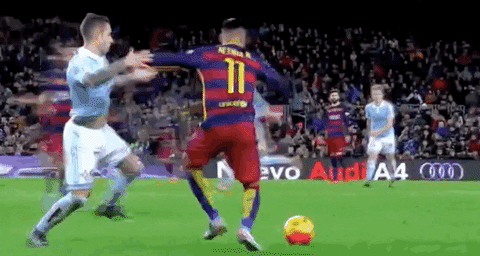

# TikiTaka
## Playing Spanish Futbol with Files and Data
- Tiki Taka is a Spanish Football Style that is dynamic and unpredictable
characterized by small pelota touches in small spaces, and hard to reason about
passes.

# Some Basic Terms

### Pelota 
We mean data

### Goalie 
We mean the file guard that prevents us from overwriting a file

### Getting passed the Defender
Using a function properly, without mistakes, otherwise you could lose the opportunity

# Some Preperation Primitives

### First Touch (or just Touch)
Setting up a location for the ball to stop at (file location)
- In Futbol, your first touch needs to be good to make the defender miss

### Double Touch 
Take an extra touch to create the path for the play, and then its location

# Passes
Facts: I've idintified 116 different passes one can do with two simple things that could be files. See the math at the bottom. These are just a few. Be patient for their implementation. Thanks.

Here are just a few, that im working on. Names will change at this early time if they end up making more sense. It is unlikely that these names will change at this point, however, the functions might change underneath them (to some other existing name), if it makes more sense.

### Passare 
Normally passing a ball down a path (directory) and to stop at the intended location (file) (append the data, do not overwrite)

### "Backwards Pass" 
Remove the origin file after passing the data to another file (append the data, do not overwrite)
- even though this ended up being a shot, it's typically a pass.

### Blind Pass
Pass data (append) to a presumably existing file without looking to see if the recipient file is there. If it is not there your script fails. (be careful)

### Butt Pass
Pass data (append) to a presumably existing file without looking to see if the recipient file is there. If it is not there script does NOT fail, it just keeps going...and going...

### Long Pass
Copy data from local filesystem file to another filesystem's file. Append it to the end of that file, does not overwrite.

### Chapeu (All Chip passes and flick passes overwrite, becareful)
"Pass over the file defender" (overwrite) a file with origins contents changing destination name to the origins name if destination file exists. If it doesn't exist, just move the origin file with the origins name to that directory.

### Rabona Chapeu (All Chip Pass's overwrite, becareful)
"Pass over the file defender" (overwrite) a file with origins contents changing destination to the origins name if file exists. If it doesn't exist, move the origin to the destination with the destination's name.

### Rainbow (flick pass to self)
"Pass over the file defender" (overwrite) a file with origins contents changing destination name to the origins name if destination file exists. If it doesn't exist, change the origin file's name with the destinations name in place.

### "Cuauhteminha" (like a safer version of an mv command to another dir with same name)
trick pass to self. (moving the file to another location keeping its name). If that location already has the same file, don't do it.

### Faux (fake pass)
Take the file data, put into buffer, delete the origin if the file exists. If it does not, remove anything from the buffer (if present) and put into file. If buffer empty, just keep going.

### "Aurelio" 
a faux (fake pass) in one direction (takes file data, puts into buffer), and dribble to the other side (creates a writestream but does not write to it yet)

# Passing Modifiers
## Tikki Takka
This is a playful feature. Basically the TikkiTakka class holds a stack and a queue. It uses the stack if you have a strong left foot.
It uses the queue if you don't. The stack (or queue) holds one of the previous tikki or takka. This all depends on what you chose first.

### Tikki
Set up an fs Read Stream (Tikki). 
- If you have a strong left, and if there was a writestream in the writestream stack, pop it off and pipe the readstream to writestream. 
- If you don't have a strong left, and there was a writestream in the writestream queue, pop it off the queue and pipe the readstream to the writestream.

### Takka 
Set up a write stream (Takka). 
- If you have a strong left, and if there was a readstream in the readstream stack, pop it off and pipe the readstream to writestream. 
- If you don't have a strong left, and there was a readstream in the readstream queue, pop it off the queue and pipe the readstream to the writestream.

### Chopping
chops a file from a starting position to an ending position, and puts into class's buffer stack (or queue, depending on strong left).

### Marseille Turn 
Sets up a circle file stream.

# Other Moves Not Related to Passing
### Fakey
Deletes a file if it exists. Creates the file if it doesn't.

### Showta (arabish for shot) 
To set up a socket or ipc to write to. Does not write (score) yet.

### Bicicleta (bicycle shot in Portuguese)
To set up a socket or ipc to read from (backwards shot). Does not read into buffer yet (does not score).

### Toe the Line
Deletes a file if it exists, otherwise throws an error

### "goooal!" or "gooooal!" 
#### goals are scored in this game, but they are hard. The rules for doing so will be announced soon.

## File Function Combinatorics:
Say you have two potential file path descriptors a and b, I've identified the following patterns:

If b is an existing file you can do the following:
1. overwrite b with a, destroy a's old file, rename b's file to a's name
2. overwrite b with a, destroy a's old file, keep b's file name
3. overwrite b with a, keep a's old file, rename b's file to a's name
4. overwrite b with a, keep a's old file, keep b's file name
5. append a to b, destroy a's old file, rename b
6. append a to b, destroy a's old file, keep b's file name
7. append a to b, keep a's old file, rename b
8. append a to b, keep a's old file, keep b's file name

If b is not an existing file, and you wish to mitigate, you can do the following:
1. move a to b's directory, keep a's old location, change a's name at new destination to b's
2. move a to b's directory, keep a's old location, keep a's name at new destination
3. move a to b's directory, destroy a's old file, change a's name at new destination to b's
4. move a to b's directory, destroy a's old file,  keep a's name at new destination
5. dont move a to b, change a's file name locally to b's name
6. don't move a to b, don't change a's name locally (basically does nothing)

If b is not an existing file, and you wish to break the program, that adds another 6
If a does not exist, and b is an existing file, you can add another 6 for mitigation.
If a does not exist, and b is an existing file, you can add another 6 that break the program.
If a and b do not exist. Then you cant pass anything, but mitigation adds another 1 if the program does nothing
If a and b do not exist. Then you can't pass anything, but a break adds another 1.

All together 8+6+20 = 44. But that's not all! If you do long passes (over a tcp socket) this doubles to 88.

If you add modifiers, which substitute a buffer for a file, then you can add another 8 patterns, leaving us at 96.
If you add modifiers, and b doesn't exist and a is a buffer, then you can add another 20. This leaves us at 116.

This does not include all the things that Tiki Taka does with streams (which is not a touch then pass, they are single touch passes with endless combinations).

If you do dribbling tricks like Chopping, they create the aforementioned buffer replacements on the pass. T buffers allow you to "process the data" before a pass or shot, you still end up in the same pass numbers above, but the combinations of real things you could before the pass are endless. These filters add to the complexity of the game to complete "objectives" and score "goals".

## Some Prophecy:
- People will use this idea to create other similar games (other sports) with the same underlying patterns. Go for it. It's really hard to make these analogies, but im confident this will not be the last one.
- Eventually, graphical game engines would interface with files and data to provide a real visual to the game. People would watch real soccer moves done by people at the command line moving data and files around in real time.

## As the sport matures, we may have small informal tournaments.

